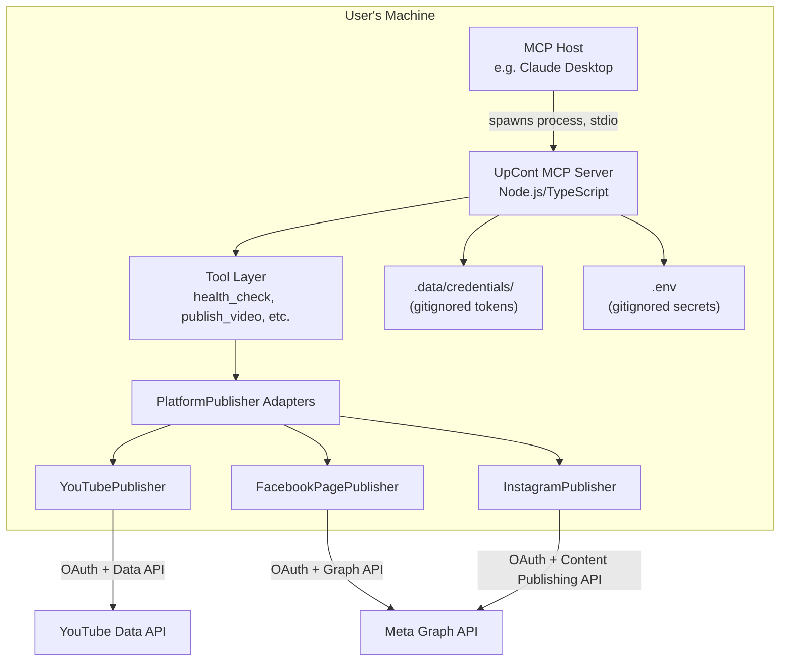
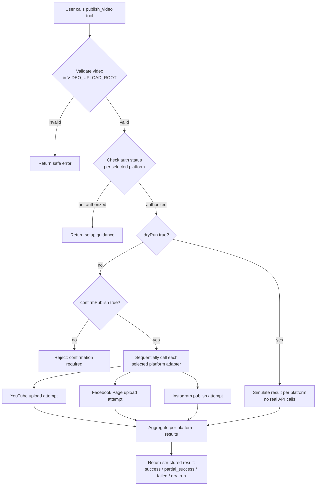

## Architecture

```mermaid
graph TD
    subgraph "User's Machine"
        Host[MCP Host<br/>e.g. Claude Desktop] -->|spawns process, stdio| Server[UpCont MCP Server<br/>Node.js/TypeScript]
        Server --> Tools[Tool Layer<br/>health_check, publish_video, etc.]
        Tools --> Adapters[PlatformPublisher Adapters]
        Adapters --> YT[YouTubePublisher]
        Adapters --> FB[FacebookPagePublisher]
        Adapters --> IG[InstagramPublisher]
        Server --> LocalData[".data/credentials/<br/>(gitignored tokens)"]
        Server --> EnvFile[".env<br/>(gitignored secrets)"]
    end

    YT -->|OAuth + Data API| YouTubeAPI[YouTube Data API]
    FB -->|OAuth + Graph API| MetaAPI[Meta Graph API]
    IG -->|OAuth + Content Publishing API| MetaAPI
```

## Video Publishing Flow

```mermaid
flowchart TD
    A[User calls publish_video tool] --> B{Validate video<br/>in VIDEO_UPLOAD_ROOT}
    B -->|invalid| Z[Return safe error]
    B -->|valid| C{Check auth status<br/>per selected platform}
    C -->|not authorized| Z2[Return setup guidance]
    C -->|authorized| D{dryRun true?}
    D -->|yes| E[Simulate result per platform<br/>no real API calls]
    D -->|no| F{confirmPublish true?}
    F -->|no| Z3[Reject: confirmation required]
    F -->|yes| G[Sequentially call each<br/>selected platform adapter]
    G --> H[YouTube upload attempt]
    G --> I[Facebook Page upload attempt]
    G --> J[Instagram publish attempt]
    H --> K[Aggregate per-platform results]
    I --> K
    J --> K
    E --> K
    K --> L[Return structured result:<br/>success / partial_success / failed / dry_run]
```